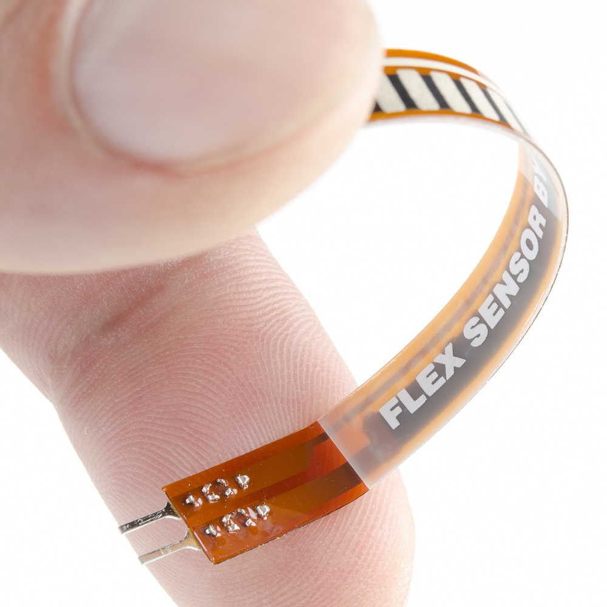
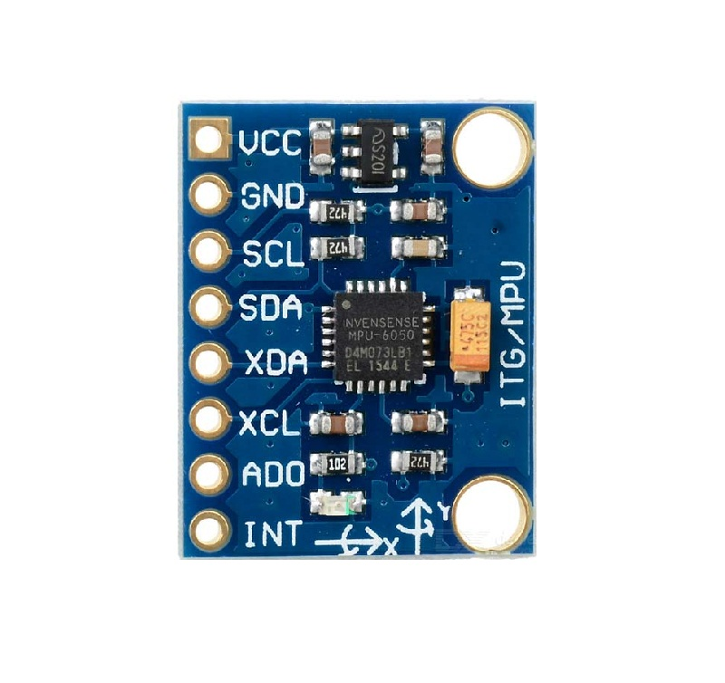
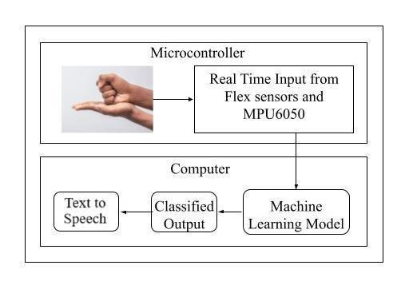
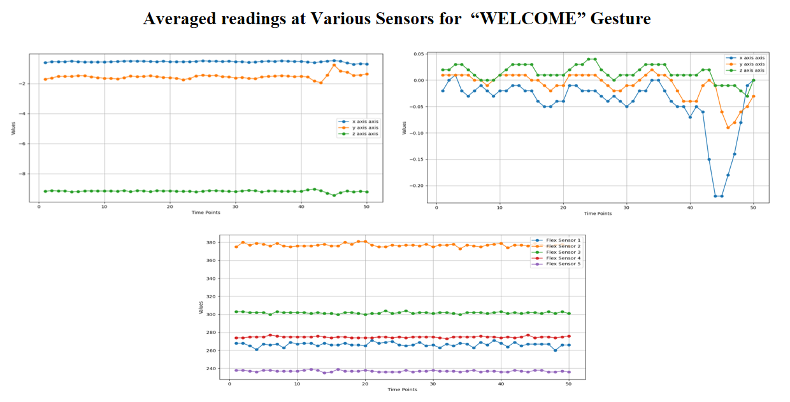
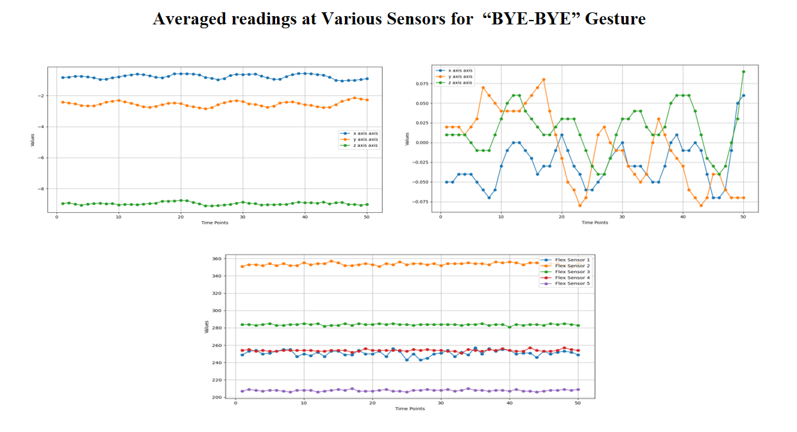
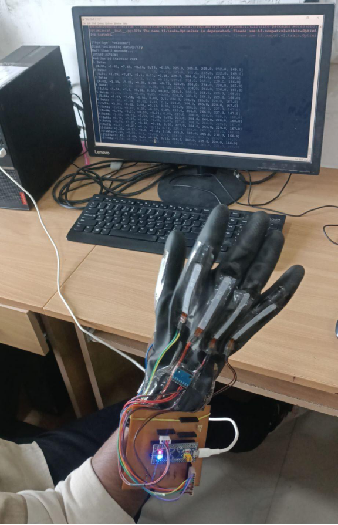

# Design-and-Development-of-Real-Time-Sign-Language-to-Speech-Conversion-System

  
*The glove is designed and fused with flex and accelerometer and gyroscope sensors, the STM32 microcontroller development board is the processing unit which is connected to Desktop for consuming power as well as establishing communication*

A real-time system designed to convert sign language gestures into spoken words, enabling seamless communication for the hearing and speech-impaired community. This project leverages embedded systems, machine learning, and text-to-speech technologies to bridge the communication gap.

---

## Table of Contents

- [Introduction](#introduction)
- [Features](#features)
- [Resources_Used](#resourcesused)
- [Block_Diagram](#blockdiagram)
- [Visuals](#visuals)
- [Demo](#demo)
- [Conclusion](#conclusion)

---

## Introduction

This project aims to create a real-time system that interprets sign language gestures using designed glove and Machine Learning and converts them into speech using text-to-speech (TTS) technology. It is designed to assist individuals with hearing or speech impairments in communicating more effectively with others.

---

## Features

- **Real-Time Gesture Recognition**: Captures and interprets sign language gestures in real-time using sensors fused on the glove.
- **Text-to-Speech Conversion**: Converts recognized gestures into audible speech.
- **Portable**: Handy and comfortable mobile glove.

---

## Resources Used

- The flex sensors are used for capturing the fingers flex movement
   

- This sensor is used for accounting the hand movements  

- This is a processing unit which takes the input from sensors and deliver it to Desktop for further process

---

## Block Diagram

The block diagram is self-explanatory.
- The designed glove is only responsible for collecting data/input.
- All processing and classification task takes place on the Desktop itself

---

## Visuals

- All three sensors data is visualized on the plot, for efficient visuals, average of each data points is taken 

- All three sensors data is visualized on the plot, for efficient visuals, average of each data points is taken 

---

## Demo

---

## Conclusion

- The designed and developed system performs well for two sign gestures only.
- Collecting more data leads to more complexity but it can be solved by designing more robust design. 
- It can be integrated with other sensors or replaced with high computing resources.
- While collecting data, sampling rate and minor fluctuations must be considered.
- Moreover, the systems overall robustness and functioning can be enhanced with more better devices and sensors.   

---

